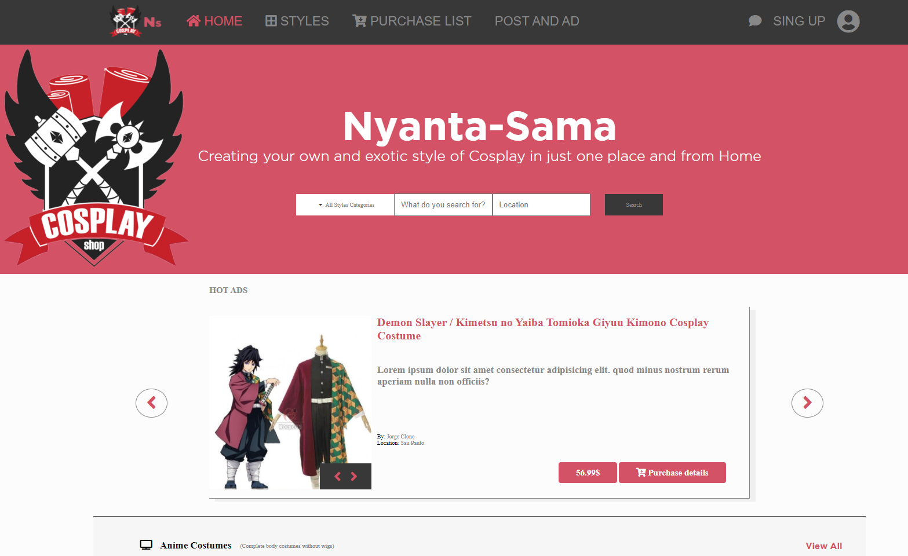

# 🧐 Cosplay-Shop Capstone-project

> This is the last HTML and CSS project from Microverse program, It's a mock-up of a ZATTIX web designed by Mohammed Awad on Behance, it's built on HTML and CSS3 languages using Sass.

## 🔧 Built With

- HTML and CSS3.
- Using UX.
- Using floats and flexbox.
- Using Sass preprocesor.
- Using StyleLinters.
- W3 HTML Validation Service.

## 🔴 Live Demo

[Live Demo Link](https://diazgio.github.io/Cosplay-shop-capstone/.)

## 🛠 Getting Started

To get a local copy up and running follow these simple example steps.

- Go to the main page of te repo.
- Press the "Code" button and get the repo link.
- Clone it using git.

## Authors

👤 **Giordano Díaz**

- Github: [@diazgio](https://github.com/diazgio)
- Twitter: [@giordano_diaz](https://twitter.com/giordano_diaz)
- LinkenIn:[LinkenIn](www.linkedin.com/in/Giordano-Diaz)

## 🤝 Contributing

Contributions, issues and feature requests are welcome!

Feel free to check the [issues page](issues/).

## Show your support

Give a ⭐️ if you like this project!

## 📝 License

This project is [MIT](lic.url) licensed.
